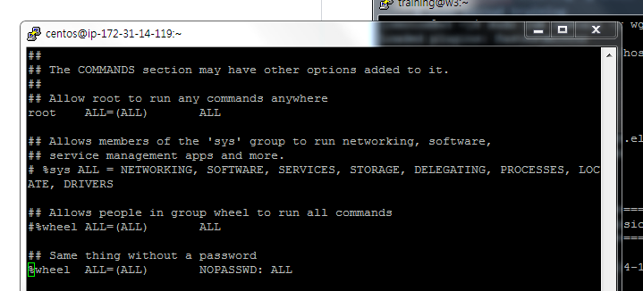

##create a CDH Cluster on AWS
a. Linux setup
```
$ sudo useradd training
$ sudo passwd training
passwd: all authentication tokens updated successfully.
$ sudo groupadd skcc
$ sudo usermod -a -G skcc training
$ sudo visudo
```

