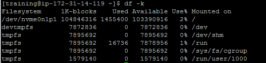
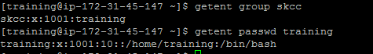

##create a CDH Cluster on AWS

###Linux setup

```
$ sudo useradd training
$ sudo passwd training
passwd: all authentication tokens updated successfully.
$ sudo groupadd skcc
$ sudo usermod -a -G skcc training
$ sudo visudo
```





###Install a MySQL server

```
$ sudo yum install -y mariadb-server
